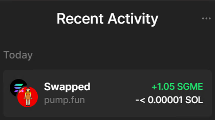
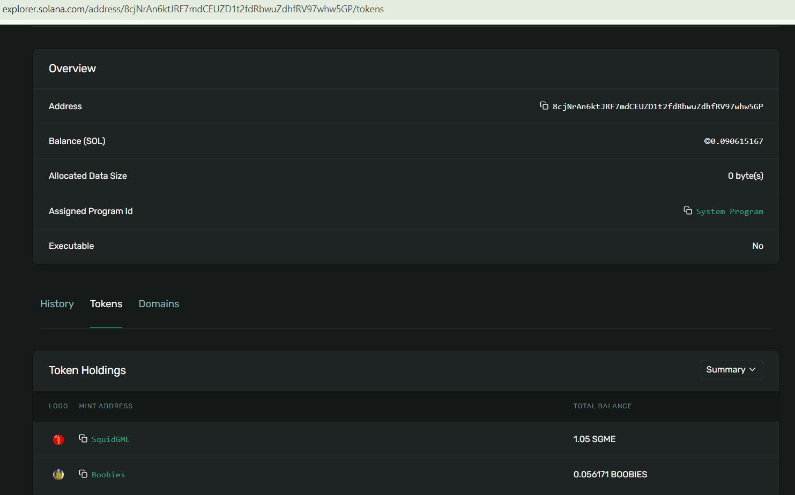
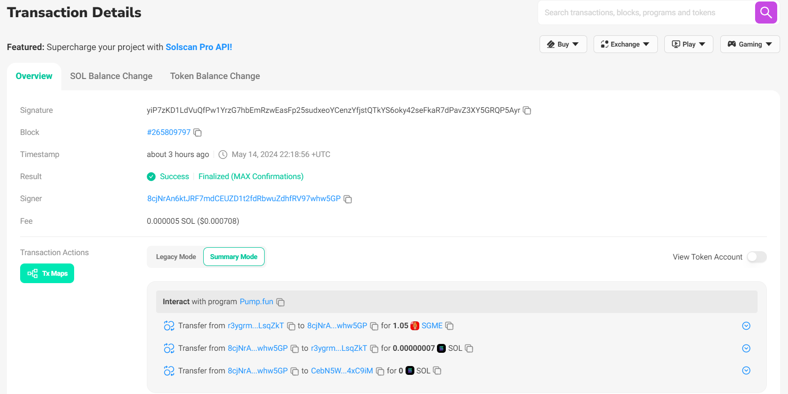

# Pump Fun Swap Transaction
This test project aims to execute swap transaction on the pump.fun. <br/>

Input Params:
```
- Wallet secret Key (Save in the .env file so that it can't be shared with others. I added example.env and you can customize it.)

- Token Mint Address (Token address you want to buy or sell)
```

Running command:
```
  npm install
  npm start
```

1. Check the associated token is existed in my wallet.
2. Create associated token account within my wallet if not exist.
3. Invoke the buy or sell function on the IDL of pump.fun program.

# Command Line Interface
1. Load multiple wallets
The functionality to load a csv file contains wallet keys and make a json file showing the token information within each wallet.

```
CLI command example : 

npm run load-wallets -- --csv pumpVolumeMakerExample.csv --output walletInfo.json
```
2. Buy and Sell transaction with params
The functionality to buy or sell transaction with private key, mint address, slippage, and amount of token.

```
CLI command example :

npm run swap-transaction -- --type buy --key 4JN5JQrvEAUPAkv9hajw4xc8Mxx1shWqbzavCbDWLeHo7QgZfCR59ro5c1kKKypivm7raD4UjMNp4bFMcKpjJ1oh --mint 9LFUtDdTqtnT1cp4FAkeNeGMrkmfrCvWiqpJHUtkHPrG --amount 0.0001 --slippage 10

npm run swap-transaction -- --type sell --key 4JN5JQrvEAUPAkv9hajw4xc8Mxx1shWqbzavCbDWLeHo7QgZfCR59ro5c1kKKypivm7raD4UjMNp4bFMcKpjJ1oh --mint 9LFUtDdTqtnT1cp4FAkeNeGMrkmfrCvWiqpJHUtkHPrG --amount 3000 --slippage 10
```

# Output
Here, I would like to show the output of this project.

 <br/>
This is the image of my wallet (phantom)


<br/>
This is the image of my account for tokens.


<br/>
This is the image of transaction details